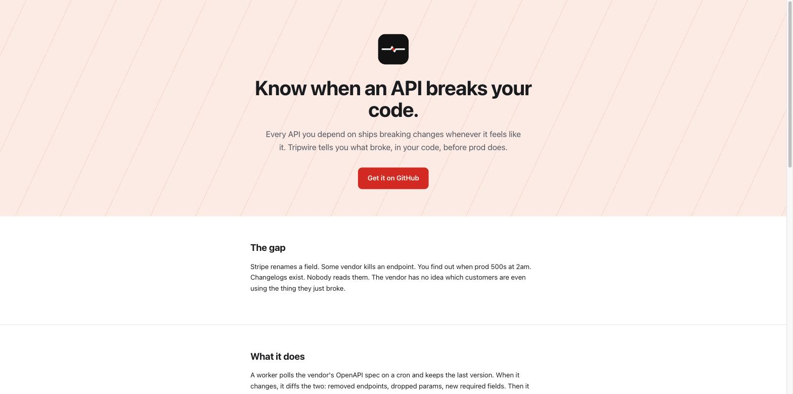
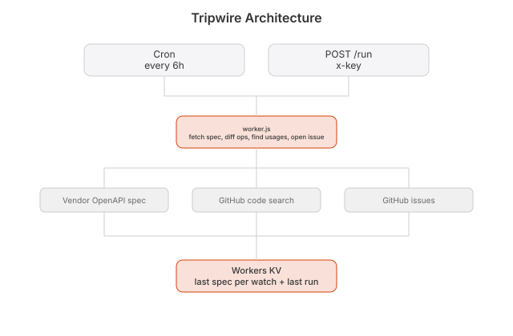

# tripwire

  [](https://github.com/nulljosh/tripwire)

Your CI goes red and you find out from a teammate, or from GitHub's mobile app, hours later. You dig through a log, find the one real line, fix it, push, wait again. Every repo, every time.

That's the gap tripwire is moving to close: watch your GitHub Actions across every repo, find the real root cause in a failing run, and open a PR with the fix already written. Not built yet, see "Where it goes" below.

What's live today: the same watch, aimed at a different kind of breakage. Every API you depend on ships changes whenever it feels like it. Stripe renames a field. Some vendor kills an endpoint. You find out when prod 500s at 2am. Changelogs exist. Nobody reads them.

## Screenshots

<p>

</p>

## What it does

A worker polls the vendor's OpenAPI spec on a cron. Keeps the last version. When it changes, it diffs the two: removed endpoints, dropped params, new required fields. Then it goes into your repo, finds the calls that just got nuked, and opens an issue that says

> `/v1/charges` is gone. You call it in these three files. Here's the diff.

That's it. That's the whole product. One file.

## Why this and not a status page

A status page tells everyone the same thing. This tells *you* what broke in *your* code. The difference between a weather report and someone knocking on your door with an umbrella.

## Where it goes

v0 (live) watches vendor APIs and opens an issue. v1 (next) watches your own GitHub Actions runs, root-causes a real failure, and opens the PR with the fix already written — CI that fixes itself instead of paging you. After that, the vendor side: they'd pay to push fixes into their customers' codebases instead of praying people read the email.

Full setup, adding watches, secrets, and testing: [DOCS.md](DOCS.md).

## Run it

```
watches.json   { name, spec (openapi json url), repo (owner/name) }
GET  /api      last run
POST /api/run  x-key: $RUN_KEY, force a run
secrets        GITHUB_TOKEN (repo + issues), RUN_KEY
cron           every 6h
```

```
node test.js
npx wrangler deploy
```

Live at [tripwire.heyitsmejosh.com](https://tripwire.heyitsmejosh.com).

**Terminal:** `swift build && ./.build/debug/tripwire-tui` — see [tui/](tui/)

## Architecture


